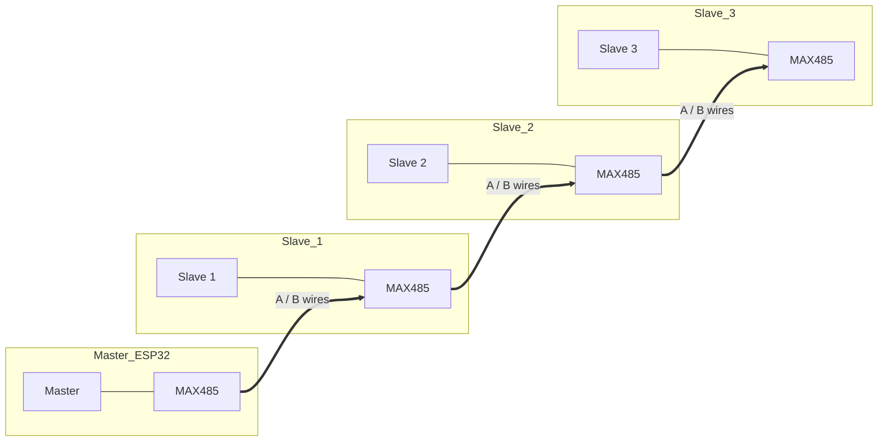

# Walkthrough - ESP32 Modbus Leak Monitor

This document guides you through setting up the multi-node leak detection system using ESP32s and Modbus RTU.

## System Overview

- **Backend**: Python (FastAPI) - Receives data and detects leaks.
- **Frontend**: Python (Streamlit) - Dashboard for visualization.
- **Master Node**: ESP32 + MAX485 - Collects data from slaves and sends to backend.
- **Slave Nodes (x3)**: ESP32 + MAX485 - Reads physical sensors and serves data.

## 1. Local Setup (Software)

### Start the Backend
The backend receives data from the Master ESP32.
```bash
uvicorn backend:app --reload --host 0.0.0.0 --port 8000
```
> **Note**: `0.0.0.0` allows the ESP32 to connect to your PC.

### Start the Dashboard
Open a new terminal to run the UI.
```bash
streamlit run app.py
```

## 2. Hardware Setup

### RS485 Bus Topology (Daisy Chain)
You need **4 x MAX485 Modules**. Connect them in a chain as shown below.
*   **VCC/GND**: Connect all modules to 3.3V or 5V (match your module).
*   **A**: Connect all `A` pins together (Green wire).
*   **B**: Connect all `B` pins together (Blue wire).
*   **120Ω Resistor**: Add between A and B at *Master* and *Slave 3* (ends of the wire).



### Pin Connections (Per ESP32)
Every ESP32 (Master and Slaves) connects to its own MAX485 module exactly the same way:

| ESP32 Pin | MAX485 Pin | Function |
| :--- | :--- | :--- |
| **GPIO 16 (RX2)** | **RO** | Receiver Output (Data to ESP32) |
| **GPIO 17 (TX2)** | **DI** | Driver Input (Data from ESP32) |
| **GPIO 4** | **DE** & **RE** | Flow Control (Connect DE and RE together to Pin 4) |
| **VIN / 3V3** | **VCC** | Power (Check modue voltage, usually 5V safe) |
| **GND** | **GND** | Ground |

### Sensor Wiring (Slaves)
- **Turbidity**: Analog Pin 34
- **Flow Sensor**: GPIO 14
- **TDS Sensor**: Analog Pin 35

### Master OLED Wiring (I2C)
- **VCC**: 3.3V
- **GND**: GND
- **SCL**: GPIO 22
- **SDA**: GPIO 21

## 3. Firmware Flashing

### Master ESP32
1.  Open `esp32_master.ino`.
2.  Update `ssid` and `password`.
3.  Update `serverUrl` with your PC's IP address (e.g., `http://192.168.1.100:8000/...`).
4.  Flash to the Master board.

### Slave ESP32s
1.  Open `esp32_slave.ino`.
2.  **Crucial**: Change `#define SLAVE_ID` for each board (1, 2, 3).
3.  Flash to each Slave board.

## 4. Verification
1.  Power up all boards.
2.  Watch the Master's Serial Monitor. It should print:
    ```
    Node 1 -> TDS: 150.00, Turb: 5.00, Flow: 0.00
    Server Res: 200
    ```
3.  Check the Streamlit Dashboard. The values for Nodes 1, 2, and 3 should update in real-time.
