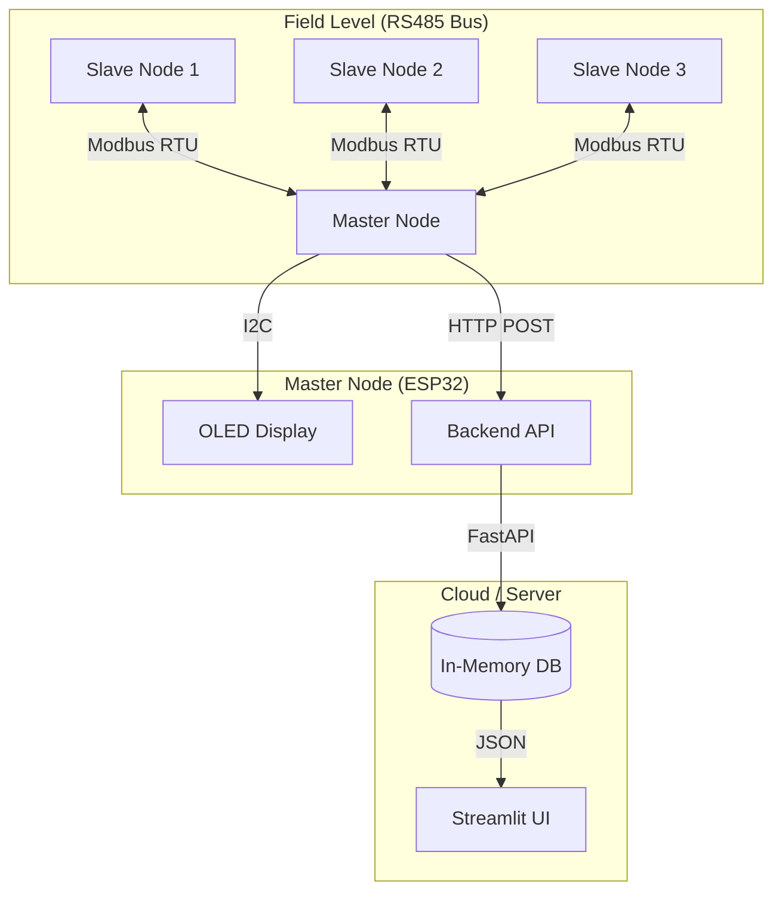

# 🚰 IoT Water Pipeline Leak Detection System


A robust, real-time monitoring system designed to detect leaks and sinkhole risks in underground water pipelines. This project utilizes a **Master-Slave architecture** with **ESP32** microcontrollers communicating via **Modbus RTU (RS485)** to collect sensor data (Flow, Turbidity, TDS) and visualize it on a modern **Streamlit Dashboard**.

---

## 🌟 Features

*   **Real-time Monitoring**: Live visualization of Flow Rate, Turbidity, and TDS levels.
*   **Leak Detection**: Automated algorithms to detect anomalies indicative of leaks.
*   **Multi-Node Architecture**: Scalable system with 1 Master and 3 Slave nodes.
*   **Robust Communication**: Uses industrial-grade Modbus RTU (RS485) for long-distance data transmission.
*   **Visual Alerts**: Dashboard highlights critical nodes with visual alarms.
*   **Predictive Maintenance**: Historical data analysis to predict potential failures (Basic Implementation).
*   **Local OLED Display**: Master node features an OLED screen for on-site diagnostics.
*   **Cloud Ready**: Designed for deployment on platforms like Render or Streamlit Cloud.

---

## 🏗️ System Architecture

The system consists of three main layers: **Sensing (Hardware)**, **Communication**, and **Application (Software)**.



---

## 🛠️ Tech Stack

### Software
*   **Backend**: Python (FastAPI, Uvicorn)
*   **Frontend**: Python (Streamlit, Pandas)
*   **Firmware**: C++ (Arduino Framework, Modbus-esp8266 Library)
*   **IDEs**: VS Code, Arduino IDE

### Hardware
*   **Controllers**: 4x ESP32 Development Boards (1 Master, 3 Slaves)
*   **Communication**: 4x MAX485 TTL to RS485 Modules
*   **Sensors**:
    *   3x YF-S201 Flow Sensors
    *   3x Turbidity Sensors (Analog)
    *   3x TDS Sensors (Analog)
*   **Display**: 1x 0.96" I2C OLED Display (SSD1306)
*   **Misc**: Jumper Wires, Breadboards, 120Ω Termination Resistors

---

## 🚀 Installation & Setup

### 1. Clone the Repository
```bash
git clone https://github.com/yourusername/leak-detection-system.git
cd leak-detection-system
```

### 2. Local Software Setup
Create a virtual environment and install dependencies:
```bash
# Windows
python -m venv venv
venv\Scripts\activate

# Install requirements
pip install -r requirements.txt
```

### 3. Hardware Firmware
**Common Library**: Install `Modbus-esp8266` by Alexander Emelianov in Arduino IDE.

*   **Master Node**:
    1.  Open `esp32_master.ino`.
    2.  Set your WiFi credentials (`ssid`, `password`).
    3.  Set `serverUrl` to your backend IP (e.g., `http://192.168.0.3:8000/api/sensor-data`).
    4.  Flash to ESP32 #1.

*   **Slave Nodes**:
    1.  Open `esp32_slave.ino`.
    2.  Change `#define SLAVE_ID` to `1`, `2`, or `3` for each board.
    3.  Flash to ESP32 #2, #3, and #4 respectively.

---

## 🏃 Usage

### Running Locally
To run the full system on your machine:

**1. Start the Backend API**
```bash
uvicorn backend:app --host 0.0.0.0 --port 8000
```

**2. Start the Dashboard**
Open a new terminal:
```bash
streamlit run app.py
```

### Cloud Deployment (Render)
1.  **Backend**: Deploy as a Web Service on Render (`uvicorn backend:app --host 0.0.0.0 --port $PORT`).
2.  **Frontend**: Deploy as a Web Service on Render (`streamlit run app.py --server.port $PORT`).
3.  **Link**: Add `BACKEND_URL` environment variable to the Frontend service pointing to the Backend's URL.

---

## 📊 Dashboard Preview

*(Add screenshots of your dashboard here)*

*   **Live Monitor**: View real-time gauge charts for each node.
*   **Data History**: Analyze trends over time.
*   **System Status**: Quick view of connectivity and leak status.

---

## 🤝 Contributing
Contributions are welcome! Please open an issue or submit a pull request for any improvements.

## 📄 License
This project is licensed under the MIT License - see the [LICENSE](LICENSE) file for details.
